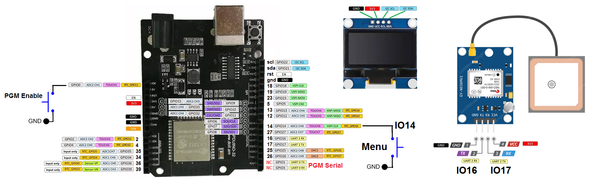
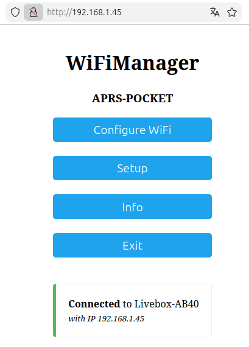
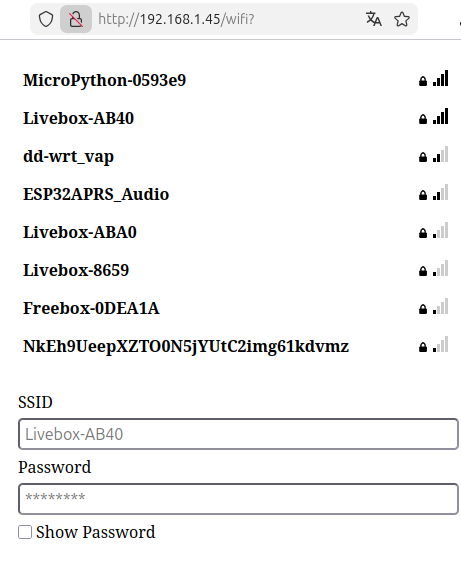
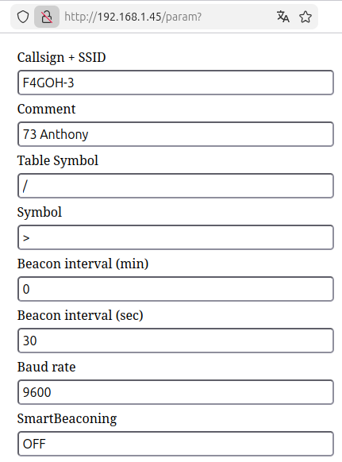
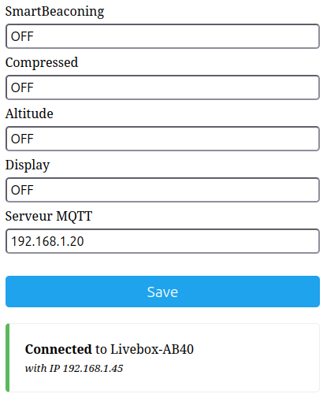
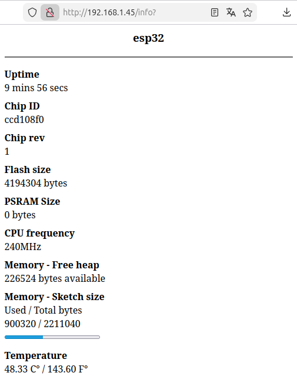
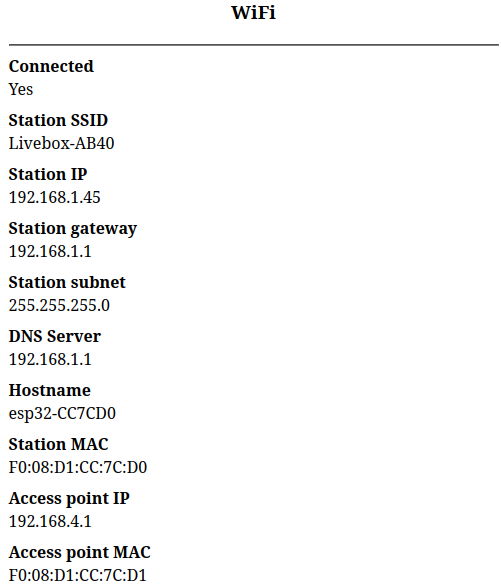
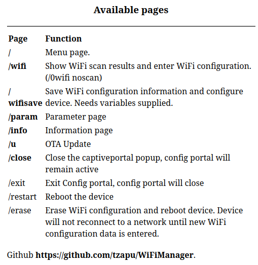

# Aprs-esp32

This project is a standalone APRS tracker based on the ESP32 and a GPS module. It can upload your position over a Wi-Fi access point when APRSDroid is not available, providing a simple autonomous solution that does not require a smartphone or any application to be running. Your position can then be viewed on [APRS.fi](https://aprs.fi/).

## Pinout

| Component   | ESP32 Pin | Description              |
|-------------|-----------|--------------------------|
| GPS TX      | GPIO 16   | ESP32 RX2                |
| GPS RX      | GPIO 17   | ESP32 TX2                |
| GPS GND     | GND       | Ground                   |
| GPS VCC     | 3.3V      | Depending on GPS module  |
| PGM button  | GPIO 0    | Active LOW               |
| MENU button | GPIO 14   | Active LOW               |
| LED BEAT    | GPIO 2    | Status / heartbeat LED   |



## SSD1306 Display

The **SSD1306 display is not supported yet**. The **Display** configuration option is already available, but support for the SSD1306 screen has not yet been implemented.

## Firmware Flasher

A web-based **ESP32 firmware flasher** is available at [https://f4goh.github.io/aprs-esp32/](https://f4goh.github.io/aprs-esp32/). It allows you to install the APRS-ESP32 firmware directly from your web browser without having to download the source code or recompile the project.

Simply connect the ESP32 via USB, select the appropriate firmware variant, choose the correct serial port, and click **Install**. The flasher requires a browser supporting Web Serial, such as **Google Chrome** or **Microsoft Edge**. 


## Initial Wi-Fi Configuration

The initial Wi-Fi configuration can be performed using a smartphone, tablet, or computer. When the **MENU button is pressed before powering on the ESP32**, the device starts an open Wi-Fi Access Point named **`APRS-POCKET`** at **192.168.4.1**, with no password. Connect to this network and open **192.168.4.1** in a web browser to configure the Wi-Fi SSID and password.

After restarting, the ESP32 connects to the configured Wi-Fi network, and its assigned IP address is displayed in the Serial Monitor. The configuration can also be modified later by accessing this IP address from a web browser.




Before powering off or restarting the device, return to the main menu and click **Exit** to complete and save the configuration.


```text
*wm:AutoConnect
*wm:Connecting to SAVED AP: Livebox-AB40
*wm:connectTimeout not set, ESP waitForConnectResult...
*wm:AutoConnect: SUCCESS
*wm:STA IP Address: 192.168.1.45
WiFi connecte

--------------------------------
Configuration APRS
--------------------------------
WiFi SSID : Livebox-AB40
IP : 192.168.1.45
Callsign : F4GOH-3
Comment : 73 Anthony
Table : /
Symbol : >
Interval : 0 min 30 sec
SmartBeaconing : OFF
Compressed : OFF
Altitude : OFF
Display : OFF
Baud : 9600
MQTT : 192.168.1.20
--------------------------------
[APRS] Connexion à rotate.aprs2.net:14580
[APRS] Connecté
[APRS] Authentifié en tant que F4GOH-3 pass=15001
[APRS] Thread d'écoute démarré
[RAM] libre : 245032
[RAM] minimum : 245004
[APRS] stack libre : 5772
[APRS RX] # aprsc 2.1.21-gbfc2090
[APRS RX] # logresp F4GOH-3 verified, server T2PANAMA
08:45:11
08:45:12
08:45:13
08:45:14
```

## APRS Configuration (Setup)

The APRS configuration page allows you to customize the information transmitted by the tracker.

- **Callsign + SSID**: Enter your APRS callsign and SSID, for example `F4GOH-3`.
- **Comment**: Text added to the APRS position report, such as `73 Anthony`.
- **Table Symbol**: Defines the APRS symbol table used for the position. `/` is the primary symbol table.
- **Symbol**: Defines the APRS icon used to represent the tracker. For example, `>` represents a car.
- **Beacon interval (min)**: Sets the number of minutes between two position transmissions.
- **Beacon interval (sec)**: Adds seconds to the beacon interval. For example, `0 min` and `30 sec` means that a position is transmitted every 30 seconds.
- **Baud rate**: Sets the serial communication speed used by the GPS module. The default value is `9600` baud.
- **SmartBeaconing**: When enabled, the tracker can dynamically adjust the beacon interval according to movement, typically transmitting more frequently when moving faster and less frequently when stationary or moving slowly.

These settings control how the ESP32 identifies itself and how its position is transmitted through APRS. The resulting position can be monitored on **APRS.fi**.

## Beacon Interval

The beacon interval is configured using **minutes** and **seconds**.

- If **minutes > 0**, a beacon is transmitted at the configured minute/second interval. For example, `2 min 30 sec` means that a frame is transmitted every **2 minutes and 30 seconds**.
- If **minutes = 0**, the interval is based only on the configured seconds. For example, `0 min 30 sec` means that a frame is transmitted every **30 seconds**.

The interval is therefore calculated as a modulo time period, allowing the tracker to transmit its APRS position automatically at the configured frequency.




### Additional APRS Settings

The lower part of the configuration page provides additional APRS and network settings:

- **SmartBeaconing**: Enables dynamic beacon intervals based on the tracker's movement (not supported yet).
- **Compressed**: Enables compressed APRS position reporting, reducing the amount of data transmitted.
- **Altitude**: Adds the GPS altitude to the APRS position report when enabled.
- **Display**: Enables or disables the connected display.
- **Serveur MQTT**: Specifies the IP address of the MQTT server used by the tracker. In this example, the MQTT server is `192.168.1.20`.

Click **Save** to apply and store the configuration.

The bottom of the page also shows the current Wi-Fi connection status. In this example, the ESP32 is connected to the Wi-Fi network **Livebox-AB40** and has been assigned the IP address **192.168.1.45**. This IP address can be used later to access the configuration page again.



```text
================================
OUVERTURE PORTAIL CONFIGURATION
================================
*wm:StartAP with SSID:  APRS-POCKET
*wm:AP IP address: 192.168.4.1
*wm:Starting Web Portal
[298032][E][WebServer.cpp:638] _handleRequest(): request handler not found
[APRS RX] # aprsc 2.1.21-gbfc2090 25 Aug 2026 08:33:54 GMT T2PANAMA 172.19.0.2:14580
[APRS RX] # aprsc 2.1.21-gbfc2090 25 Aug 2026 08:34:14 GMT T2PANAMA 172.19.0.2:14580
[APRS RX] # aprsc 2.1.21-gbfc2090 25 Aug 2026 08:34:34 GMT T2PANAMA 172.19.0.2:14580
[APRS RX] # aprsc 2.1.21-gbfc2090 25 Aug 2026 08:34:54 GMT T2PANAMA 172.19.0.2:14580
*wm:9 networks found
[377643][E][WebServer.cpp:638] _handleRequest(): request handler not found
[APRS RX] # aprsc 2.1.21-gbfc2090 25 Aug 2026 08:35:14 GMT T2PANAMA 172.19.0.2:14580
[APRS RX] # aprsc 2.1.21-gbfc2090 25 Aug 2026 08:35:34 GMT T2PANAMA 172.19.0.2:14580
[APRS RX] # aprsc 2.1.21-gbfc2090 25 Aug 2026 08:35:54 GMT T2PANAMA 172.19.0.2:14580
[422362][E][WebServer.cpp:638] _handleRequest(): request handler not found
[APRS RX] # aprsc 2.1.21-gbfc2090 25 Aug 2026 08:36:14 GMT T2PANAMA 172.19.0.2:14580
[APRS RX] # aprsc 2.1.21-gbfc2090 25 Aug 2026 08:36:34 GMT T2PANAMA 172.19.0.2:14580
[APRS RX] # aprsc 2.1.21-gbfc2090 25 Aug 2026 08:36:54 GMT T2PANAMA 172.19.0.2:14580
[APRS RX] # aprsc 2.1.21-gbfc2090 25 Aug 2026 08:37:14 GMT T2PANAMA 172.19.0.2:14580
[APRS RX] # aprsc 2.1.21-gbfc2090 25 Aug 2026 08:37:34 GMT T2PANAMA 172.19.0.2:14580
[APRS RX] # aprsc 2.1.21-gbfc2090 25 Aug 2026 08:37:54 GMT T2PANAMA 172.19.0.2:14580
[APRS RX] # aprsc 2.1.21-gbfc2090 25 Aug 2026 08:38:14 GMT T2PANAMA 172.19.0.2:14580
[APRS RX] # aprsc 2.1.21-gbfc2090 25 Aug 2026 08:38:34 GMT T2PANAMA 172.19.0.2:14580
[595012][E][WebServer.cpp:638] _handleRequest(): request handler not found
[597806][E][WebServer.cpp:638] _handleRequest(): request handler not found
[APRS RX] # aprsc 2.1.21-gbfc2090 25 Aug 2026 08:38:54 GMT T2PANAMA 172.19.0.2:14580
[APRS RX] # aprsc 2.1.21-gbfc2090 25 Aug 2026 08:39:14 GMT T2PANAMA 172.19.0.2:14580
[APRS RX] # aprsc 2.1.21-gbfc2090 25 Aug 2026 08:39:34 GMT T2PANAMA 172.19.0.2:14580
[APRS RX] # aprsc 2.1.21-gbfc2090 25 Aug 2026 08:39:54 GMT T2PANAMA 172.19.0.2:14580
[APRS RX] # aprsc 2.1.21-gbfc2090 25 Aug 2026 08:40:14 GMT T2PANAMA 172.19.0.2:14580
[APRS RX] # aprsc 2.1.21-gbfc2090 25 Aug 2026 08:40:34 GMT T2PANAMA 172.19.0.2:14580
[APRS RX] # aprsc 2.1.21-gbfc2090 25 Aug 2026 08:40:54 GMT T2PANAMA 172.19.0.2:14580
[APRS RX] # aprsc 2.1.21-gbfc2090 25 Aug 2026 08:41:14 GMT T2PANAMA 172.19.0.2:14580
[APRS RX] # aprsc 2.1.21-gbfc2090 25 Aug 2026 08:41:34 GMT T2PANAMA 172.19.0.2:14580
[APRS RX] # aprsc 2.1.21-gbfc2090 25 Aug 2026 08:41:54 GMT T2PANAMA 172.19.0.2:14580
*wm:config portal exiting

================================
LECTURE PARAMETRES APRS
================================
Callsign recu : F4GOH-3
Comment recu : 73 Anthony
Table recu : /
Symbol recu : >
Minute recue : 0
Second recu : 30
Baud recu : 9600
SmartBeaconing : OFF
Compressed : OFF
Altitude : OFF
Display : OFF
MQTT : 192.168.1.20
Configuration APRS sauvegardee

Configuration rechargee depuis Preferences

--------------------------------
Configuration APRS
--------------------------------
WiFi SSID : Livebox-AB40
IP : 192.168.1.45
Callsign : F4GOH-3
Comment : 73 Anthony
Table : /
Symbol : >
Interval : 0 min 30 sec
SmartBeaconing : OFF
Compressed : OFF
Altitude : OFF
Display : OFF
Baud : 9600
MQTT : 192.168.1.20
--------------------------------

Configuration rechargee depuis Preferences

--------------------------------
Configuration APRS
--------------------------------
WiFi SSID : Livebox-AB40
IP : 192.168.1.45
Callsign : F4GOH-3
Comment : 73 Anthony
Table : /
Symbol : >
Interval : 0 min 30 sec
SmartBeaconing : OFF
Compressed : OFF
Altitude : OFF
Display : OFF
Baud : 9600
MQTT : 192.168.1.20
--------------------------------
[APRS RX] # aprsc 2.1.21-gbfc2090 25 Aug 2026 08:42:14 GMT T2PANAMA 172.19.0.2:14580
[APRS RX] # aprsc 2.1.21-gbfc2090 25 Aug 2026 08:42:34 GMT T2PANAMA 172.19.0.2:14580
[APRS RX] # aprsc 2.1.21-gbfc2090 25 Aug 2026 08:42:54 GMT T2PANAMA 172.19.0.2:14580
[APRS RX] # aprsc 2.1.21-gbfc2090 25 Aug 2026 08:43:14 GMT T2PANAMA 172.19.0.2:14580
[APRS RX] # aprsc 2.1.21-gbfc2090 25 Aug 2026 08:43:34 GMT T2PANAMA 172.19.0.2:14580
Configuration terminee
08:43:42
08:43:43
```

## ESP32 System Information (Info)

The **Info** page provides useful information about the ESP32 hardware and the current state of the device:

- **Uptime**: Shows how long the ESP32 has been running since the last restart or power-on.
- **Chip ID**: Displays the unique identifier of the ESP32 chip.
- **Chip rev**: Indicates the hardware revision of the ESP32 chip.
- **Flash size**: Shows the total amount of flash memory available on the ESP32. In this example, `4,194,304 bytes` corresponds to **4 MB**.
- **PSRAM Size**: Displays the amount of external PSRAM available. `0 bytes` means that no PSRAM is detected or available.
- **CPU frequency**: Shows the processor clock frequency. Here it is running at **240 MHz**.
- **Memory - Free heap**: Indicates the amount of RAM currently available for the application. This value can decrease as the program allocates memory.
- **Memory - Sketch size**: Shows the amount of flash memory currently used by the firmware compared with the total available space. In this example, approximately **900 KB of 2.2 MB** is used.
- **Temperature**: Displays the internal ESP32 temperature in both Celsius and Fahrenheit. This value is useful for monitoring the chip, although it should be considered an approximate indication rather than an accurate ambient temperature measurement.

This page is mainly intended for **diagnostics and troubleshooting**, allowing you to quickly check the ESP32 hardware, memory usage, CPU speed, uptime, and temperature without connecting to the Serial Monitor.





## APRS-IS Connection

The ESP32 connects to the **APRS-IS network** through the server **`rotate.aprs2.net`** on TCP port **`14580`**. This server provides automatic rotation to an available APRS-IS server, allowing the tracker to upload its APRS frames to the network.

Once connected and authenticated with the configured callsign and APRS-IS password, the ESP32 can transmit its position and other APRS information. The transmitted position can then be viewed on services such as **APRS.fi**.

```text
08:43:59
08:44:00

========================================
              APRS TX
========================================
[GPS] Position
  Latitude  : 47.890251°
  Longitude : 0.276794°
----------------------------------------
[APRS] PDU générée :
!4753.42N/00016.61E>73 Anthony
----------------------------------------
[APRS] Envoi position...
[APRS] Position envoyée
========================================

08:44:01
08:44:02
08:44:03
```


